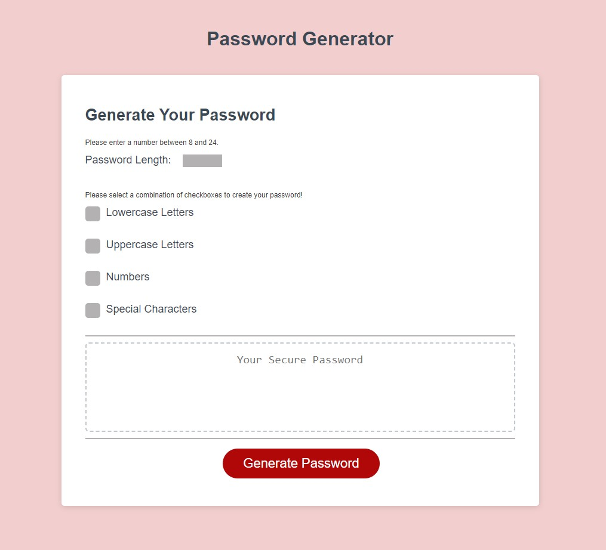

# Password Generator 

  # Table of Content
- [Password Generator ](#password-generator-)
- [Table of Content](#table-of-content)
  - [Description:](#description)
  - [Installation:](#installation)
  - [License:](#license)
  - [Tests:](#tests)
  - [Preview:](#preview)
  - [Deployment](#deployment)
  - [Accreditations:](#accreditations)

## Description:
The Password Generator is a static html page that allows a user to define input options that sets the criteria to generate a random password string. The input values have validations that alert a user if a selected option falls outside of the accepted criteria. A generated password can contain between 8 and 24 characters and must be made up of at least all lowercase letters, uppercase letters, numbers, special characters, or a combination of any of these four inputs.

## Installation:
No installation required. To access the Password Generato make sure you are connected to a WiFi network, or are on a data plan for mobile, and follow the GitHub Pages Link [here:](https://snovelli1021.github.io/PasswordGenerator/)

## License:
Copyright 2022, Stephen Novelli

Permission is hereby granted, free of charge, to any person obtaining a copy of this software and associated documentation files (the "Software"), to deal in the Software without restriction, including without limitation the rights to use, copy, modify, merge, publish, distribute, sublicense, and/or sell copies of the Software, and to permit persons to whom the Software is furnished to do so, subject to the following conditions:

The above copyright notice and this permission notice shall be included in all copies or substantial portions of the Software.

THE SOFTWARE IS PROVIDED "AS IS", WITHOUT WARRANTY OF ANY KIND, EXPRESS OR IMPLIED, INCLUDING BUT NOT LIMITED TO THE WARRANTIES OF MERCHANTABILITY, FITNESS FOR A PARTICULAR PURPOSE AND NONINFRINGEMENT. IN NO EVENT SHALL THE AUTHORS OR COPYRIGHT HOLDERS BE LIABLE FOR ANY CLAIM, DAMAGES OR OTHER LIABILITY, WHETHER IN AN ACTION OF CONTRACT, TORT OR OTHERWISE, ARISING FROM, OUT OF OR IN CONNECTION WITH THE SOFTWARE OR THE USE OR OTHER DEALINGS IN THE SOFTWARE.

[View License](https://www.mit.edu/~amini/LICENSE.md) 
       
## Tests:
No tests are currently required to run this application.
    
## Preview:

## Deployment

The Password Generator is deployed for live use on GitHub Pages [here:](https://snovelli1021.github.io/PasswordGenerator/)

## Accreditations:
The custom checkboxes used for the Password Generator were created using code from the below source. Although some stylistic options were modified, the core of the code base was derrived directly from the included article.  

"W3schools. How To Create a Custom Checkbox and Radio Buttons. (May 20, 2023). *How TO - Custom Checkbox*. https://www.w3schools.com/howto/howto_css_custom_checkbox.asp"